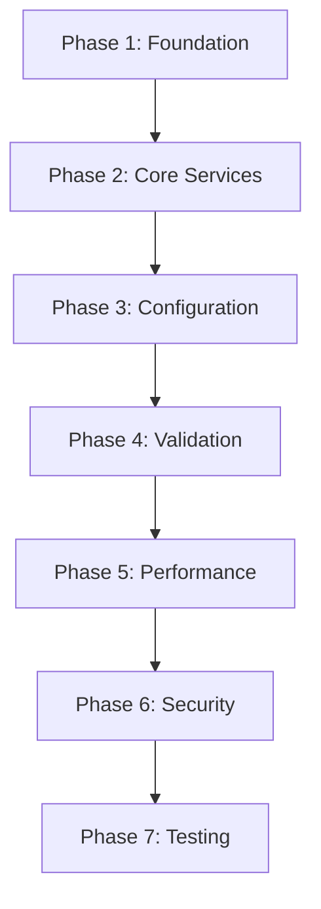

# DecorStore API - Master Refactor Plan

**Project**: DecorStore.API Complete Architecture Refactoring  
**Timeline**: 20 Days (4 Phases Critical + 3 Phases Enhancement)  
**Start Date**: 2025-06-05  
**Goal**: Transform legacy API to clean architecture with modern patterns

---

## 🎯 **Refactor Objectives**

### **Primary Goals**
- Implement clean architecture patterns (Repository, Result<T>, DI)
- Establish consistent error handling across all endpoints
- Optimize performance with proper async/await and caching
- Ensure code quality with SOLID principles
- Standardize validation and DTOs

### **Secondary Goals**
- Enhance security and authorization
- Improve monitoring and logging
- Complete test coverage
- Comprehensive documentation

---

## 📅 **Phase Timeline Overview**

| Phase | Days | Priority | Focus Area | Impact |
|-------|------|----------|------------|---------|
| **Phase 1** | 1-3 | 🔥 CRITICAL | Foundation & Architecture | ✅ COMPLETED |
| **Phase 2** | 4-6 | 🔥 CRITICAL | Core Services & Controllers | 🚧 IN PROGRESS |
| **Phase 3** | 7-8 | 🔥 CRITICAL | Configuration & Infrastructure | ⏳ PLANNED |
| **Phase 4** | 9-11 | 🔥 CRITICAL | Validation & Error Handling | ⏳ PLANNED |
| **Phase 5** | 12-14 | ⚡ HIGH | Performance & Caching | ⏳ PLANNED |
| **Phase 6** | 15-17 | ⚡ HIGH | Security & Authorization | ⏳ PLANNED |
| **Phase 7** | 18-20 | 📋 MEDIUM | Testing & Documentation | ⏳ PLANNED |

---

## 🏗️ **Architecture Evolution**

### **Current State (Legacy)**
```
Controller → Service → Repository → Database
     ↓         ↓          ↓
Manual Error  Exception   Direct EF
Handling      Throwing    Operations
```

### **Target State (Clean Architecture)**
```
Controller → Service → Repository → Database
(BaseController)  ↓         ↓          ↓
     ↓       Result<T>  BaseRepo  Optimized
HandleResult   Pattern   Pattern    Queries
     ↓                               ↓
Standardized                   Performance
Responses                      Monitoring
```

---

## 📊 **Progress Tracking**

### **✅ Phase 1: Foundation & Architecture (COMPLETED)**
- [x] Base Repository Pattern
- [x] Result<T> Pattern Implementation
- [x] BaseController Creation
- [x] ProductService & ProductController Refactoring

### **🚧 Current Focus: Phase 2**
**Core Services & Controllers Refactoring**
- Progress: 0% (Ready to start)
- Next: CategoryService + CategoryController

---

## 🎯 **Quality Gates (All Phases)**

### **✅ Code Quality Requirements**
- **Single Responsibility**: Each method max 20 lines, single purpose
- **Naming Conventions**: PascalCase classes, camelCase variables, descriptive names  
- **Code Duplication**: Max 3 lines duplicate code allowed, extract to methods/classes
- **SOLID Principles**: Dependency injection, interface segregation
- **Clean Code**: Meaningful variable names, clear method signatures

### **✅ Performance Requirements**
- **Async/Await**: All database calls must be async, no .Result or .Wait()
- **Database Queries**: Include related data efficiently, use AsNoTracking for read-only
- **Caching**: Response caching for GET operations, memory caching for reference data
- **Query Optimization**: Proper indexing, avoid N+1 queries
- **Resource Management**: Proper disposal of resources

### **✅ Error Handling Requirements**
- **Global Exception Handler**: Catch all unhandled exceptions
- **Structured Logging**: Use ILogger with correlation IDs  
- **Error Messages**: User-friendly messages, detailed logs for debugging
- **Result<T> Pattern**: Consistent error responses across all endpoints
- **Validation**: Input validation with meaningful error messages

---

## 🔄 **Phase Dependencies**



### **Critical Path**
1. **Foundation** → Must complete first (provides base patterns)
2. **Core Services** → Refactor all business logic
3. **Configuration** → Infrastructure setup
4. **Validation** → Input validation & error handling
5. **Performance** → Optimization & caching
6. **Security** → Enhanced auth & authorization
7. **Testing** → Verification & documentation

---

## 📈 **Success Metrics**

### **Quantitative Goals**
- **Code Reduction**: 30% reduction in controller code
- **Error Consistency**: 100% of endpoints return standardized errors
- **Performance**: 50% reduction in database query time
- **Test Coverage**: 90%+ code coverage
- **Documentation**: 100% API endpoints documented

### **Qualitative Goals**
- **Maintainability**: Easy to add new features
- **Scalability**: Support for future growth
- **Developer Experience**: Clear patterns and conventions
- **User Experience**: Fast, reliable API responses
- **Code Quality**: Clean, readable, testable code

---

## 🚨 **Risk Management**

### **High-Risk Areas**
- **Authentication Changes**: Potential breaking changes
- **Database Migrations**: Data integrity during refactor
- **Performance Regression**: Ensure optimizations don't break functionality
- **API Contract Changes**: Maintain backward compatibility

### **Mitigation Strategies**
- **Incremental Refactoring**: One service at a time
- **Backward Compatibility**: Maintain existing API contracts
- **Testing**: Comprehensive testing after each phase
- **Rollback Plan**: Ability to revert changes if needed

---

## 📋 **Phase Tracking Files**

| Phase | Tracking File | Status |
|-------|---------------|---------|
| Phase 1 | `Phase1-Foundation-Tracking.md` | ✅ COMPLETED |
| Phase 2 | `Phase2-Core-Services-Tracking.md` | ✅ READY |
| Phase 3 | `Phase3-Configuration-Infrastructure-Tracking.md` | ✅ READY |
| Phase 4 | `Phase4-Validation-Error-Handling-Tracking.md` | ✅ READY |
| Phase 5 | `Phase5-Performance-Caching-Tracking.md` | ✅ READY |
| Phase 6 | `Phase6-Security-Authorization-Tracking.md` | ✅ READY |
| Phase 7 | `Phase7-Testing-Documentation-Tracking.md` | ✅ READY |

---

**Last Updated**: 2025-06-05  
**Current Phase**: Phase 2 - Core Services & Controllers  
**Overall Status**: 🚧 In Progress (Phase 1 Complete)
